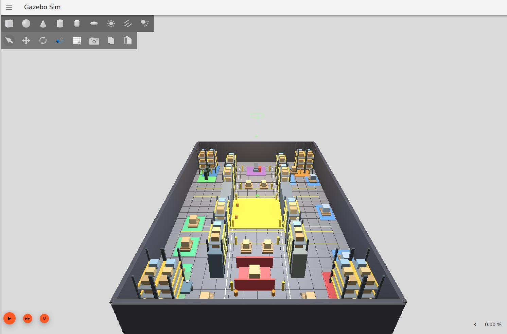

# Synaids-AMR

## Multi-AMR Fleet Coordination for Smart Warehouse Operations

**Synaids-AMR** is a ROS 2 Jazzy and Gazebo Sim 8-based multi-robot
warehouse simulation focused on **fleet coordination, predictive
collision avoidance, intersection management, and intelligent
decision-making for Autonomous Mobile Robots (AMRs).**



------------------------------------------------------------------------

## Project Overview

Synaids-AMR demonstrates how multiple autonomous mobile robots can
operate safely and efficiently within a shared warehouse environment.

The simulation provides a realistic warehouse layout containing:

-   **Multiple storage racks**
-   **Pickup and delivery zones**
-   **Central traffic intersection**
-   **Charging stations**
-   **Maintenance area**
-   **Restricted zones**
-   **Waiting and parking areas**
-   **Dynamic and static obstacles**
-   **Pallets and warehouse packages**
-   **Traffic markings and safety areas**

The primary focus is the coordination of multiple AMRs while maintaining
safe distances and resolving potential conflicts in shared workspaces.

------------------------------------------------------------------------

## Project Objectives

1.  **Multi-Robot Coordination** --- Coordinate multiple AMRs operating
    simultaneously within the same warehouse.
2.  **Collision Prevention** --- Detect potential conflicts between
    robots before unsafe situations occur.
3.  **Predictive Conflict Analysis** --- Estimate future robot positions
    and identify possible trajectory conflicts.
4.  **Intersection Management** --- Determine which robot should receive
    priority when multiple robots approach a shared intersection.
5.  **Priority-Based Decision Making** --- Use robot priority levels to
    resolve conflicts in an organized manner.
6.  **Safe Fleet Operation** --- Stop or reroute lower-priority robots
    when necessary.
7.  **Realistic Warehouse Simulation** --- Provide an enhanced warehouse
    environment for demonstrating practical AMR fleet coordination.

------------------------------------------------------------------------

## AMR Fleet

  Robot    Role                      Priority
  -------- ------------------------- ------------
  **R1**   Autonomous Mobile Robot   **High**
  **R2**   Autonomous Mobile Robot   **Medium**
  **R3**   Autonomous Mobile Robot   **Low**

### Priority Order

**R1 \> R2 \> R3**

When multiple robots approach the same shared workspace, the fleet
coordinator uses the configured priority levels to determine which robot
should proceed first.

------------------------------------------------------------------------

## Fleet Coordination Workflow

``` text
Robot State
     |
     v
Position and Motion Monitoring
     |
     v
Current Distance Analysis
     |
     v
Future Position Prediction
     |
     v
Conflict Detection
     |
     v
Priority Evaluation
     |
     v
Decision Making
     |
     v
PROCEED / STOP / REROUTE
```

This approach allows the system to identify potential conflicts before
they develop into actual collisions.

------------------------------------------------------------------------

## Intersection Conflict Management

A major feature of Synaids-AMR is **multi-robot intersection
management**.

When multiple robots approach a shared intersection, the coordinator
evaluates:

-   **Current distance between robots**
-   **Predicted future distance**
-   **Robot priority**
-   **Potential trajectory conflicts**
-   **Safety distance thresholds**

If a conflict is detected, the coordinator assigns priority to one robot
and can automatically stop a lower-priority robot.

### Example Decision

``` text
R1  -------------------->

              INTERSECTION
                   X
                  /                  /   
R2  <------------

        Potential Conflict
                |
                v
        Priority Evaluation
                |
                v
        R1 Has Higher Priority
                |
                v
            R2 STOPPED
                |
                v
            R1 PROCEEDS
```

------------------------------------------------------------------------

## System Architecture

``` text
                 +---------------------------+
                 |       Gazebo Sim 8        |
                 |   Realistic Warehouse     |
                 |       R1   R2   R3        |
                 +-------------+-------------+
                               |
                               | ROS-Gazebo Bridge
                               v
                 +---------------------------+
                 |        ROS 2 Jazzy        |
                 |  Odometry / Laser Scan    |
                 |  Velocity Commands        |
                 +-------------+-------------+
                               |
                               v
                 +---------------------------+
                 |     Fleet Coordinator     |
                 |  Position Monitoring      |
                 |  Future Prediction        |
                 |  Conflict Detection       |
                 |  Priority Management      |
                 |  Stop / Reroute Logic     |
                 +-------------+-------------+
                               |
                               v
                 +---------------------------+
                 |       Robot Actions       |
                 |   PROCEED / STOP /        |
                 |        REROUTE            |
                 +---------------------------+
```

------------------------------------------------------------------------

## Warehouse Environment

The enhanced warehouse environment contains several operational areas
designed to provide a realistic setting for AMR coordination.

### Storage Infrastructure

-   **Multi-level storage racks**
-   **Warehouse aisles**
-   **Pallet and package locations**
-   **Structured traffic lanes**

### Material Handling Areas

-   **Pickup zones**
-   **Drop-off zones**
-   **Pallets and packages**
-   **Robot waiting areas**

### Fleet Infrastructure

-   **Charging stations**
-   **Maintenance area**
-   **Parking and waiting bays**
-   **Restricted areas**

### Safety and Traffic Features

-   **Central intersection**
-   **Traffic markings**
-   **Traffic cones**
-   **Blocked aisle**
-   **Static and dynamic obstacles**
-   **Safety zones**

------------------------------------------------------------------------

## Technology Stack

  Technology              Purpose
  ----------------------- --------------------------------------------
  **ROS 2 Jazzy**         Robot communication and fleet coordination
  **Gazebo Sim 8**        Warehouse and robot simulation
  **Python 3**            Coordination and simulation logic
  **ROS-Gazebo Bridge**   Communication between ROS 2 and Gazebo
  **SDF**                 Robot and warehouse simulation models
  **Ubuntu / WSL2**       Development environment

------------------------------------------------------------------------

## Repository Structure

``` text
Synaids-AMR/
|
+-- robots/
|   +-- amr1.sdf
|   +-- r2.sdf
|   +-- r3.sdf
|
+-- worlds/
|   +-- warehouse_multi.sdf
|   +-- warehouse_enhanced.sdf
|   +-- warehouse_realistic.sdf
|
+-- ros2_ws/
|   +-- src/
|       +-- fleet_coordinator/
|
+-- build_realistic_warehouse.py
+-- enhance_warehouse.py
+-- intersection_demo.py
|
+-- warehouse_realistic.png
+-- README_FOR_FRIENDS.txt
+-- README.md
+-- .gitignore
```

------------------------------------------------------------------------

## Getting Started

### Requirements

-   **Ubuntu / WSL2**
-   **ROS 2 Jazzy**
-   **Gazebo Sim 8**
-   **Python 3**
-   **ROS-Gazebo Bridge**

### Source ROS 2

``` bash
source /opt/ros/jazzy/setup.bash
```

### Launch the Realistic Warehouse

``` bash
export LIBGL_ALWAYS_SOFTWARE=1
gz sim ~/synaids_amr/worlds/warehouse_realistic.sdf
```

The enhanced warehouse environment will open in Gazebo Sim.

------------------------------------------------------------------------

## ROS-Gazebo Communication

The AMRs communicate with ROS 2 through the ROS-Gazebo bridge.

``` text
/R1/cmd_vel
/R1/odom
/R1/scan

/R2/cmd_vel
/R2/odom
/R2/scan

/R3/cmd_vel
/R3/odom
/R3/scan
```

These interfaces provide **velocity commands, robot odometry, and laser
scan information** for the three-robot fleet.

------------------------------------------------------------------------

## Main Components

### `fleet_coordinator`

The ROS 2 fleet coordination package responsible for:

-   **Robot state monitoring**
-   **Position tracking**
-   **Future position prediction**
-   **Conflict detection**
-   **Priority evaluation**
-   **Stop commands**
-   **Coordinated fleet behavior**

### `warehouse_realistic.sdf`

The main enhanced warehouse simulation environment containing the
realistic warehouse infrastructure and operational areas.

### `build_realistic_warehouse.py`

Python utility used to generate the enhanced warehouse environment.

### `intersection_demo.py`

Demonstration logic for a three-robot intersection scenario involving:

-   **Robot approach**
-   **Conflict analysis**
-   **Priority selection**
-   **Robot stopping**
-   **Selected robot execution**
-   **Rerouting behavior**

------------------------------------------------------------------------

## Predictive Conflict Detection

The fleet coordinator evaluates both the **current separation** and the
**predicted future separation** between robots.

``` text
Current Robot Positions
          |
          v
Estimate Future Positions
          |
          v
Calculate Predicted Separation
          |
          v
Compare Against Safety Threshold
          |
          v
       Conflict?
       /       \
     YES        NO
      |          |
      v          v
Priority      Continue
Decision       Normal
      |
      v
STOP / REROUTE
```

This predictive approach provides a foundation for more advanced
multi-agent path planning and fleet traffic management.

------------------------------------------------------------------------

## Current Implementation

-   [x] **Three-AMR warehouse environment**
-   [x] **Realistic warehouse infrastructure**
-   [x] **ROS 2 Jazzy integration**
-   [x] **Gazebo Sim 8 integration**
-   [x] **ROS-Gazebo communication**
-   [x] **Robot odometry**
-   [x] **Laser scan interfaces**
-   [x] **Multi-robot position tracking**
-   [x] **Predictive distance analysis**
-   [x] **Conflict detection**
-   [x] **Priority-based conflict resolution**
-   [x] **Automatic stopping of lower-priority robots**
-   [x] **Three-robot intersection demonstration**

------------------------------------------------------------------------

## Future Development

Potential future extensions include:

-   **Multi-Agent Path Finding (MAPF)**
-   **Global path planning**
-   **Dynamic task allocation**
-   **Real-time task scheduling**
-   **Battery-aware fleet management**
-   **Improved localization**
-   **Advanced trajectory prediction**
-   **Dynamic obstacle avoidance**
-   **Reinforcement learning for fleet decisions**
-   **Traffic-aware route optimization**
-   **Scalability to larger AMR fleets**
-   **Integration with warehouse management systems**

------------------------------------------------------------------------

## Project Status

**Status: Active Development**

The current implementation provides a simulation framework for
demonstrating **multi-AMR coordination and predictive intersection
conflict management** in an enhanced warehouse environment.

The architecture is designed to support future development toward more
advanced:

-   **Fleet scheduling**
-   **Path planning**
-   **Task allocation**
-   **Traffic management**
-   **Autonomous warehouse coordination**

------------------------------------------------------------------------

## Project Information

**Project:** Synaids-AMR\
**Focus:** Multi-AMR Fleet Coordination\
**Application:** Smart Warehouse Operations\
**Simulation Platform:** ROS 2 Jazzy + Gazebo Sim 8

------------------------------------------------------------------------

## Quick Start Guide

For a simplified setup guide intended for friends and collaborators,
refer to:

``` text
README_FOR_FRIENDS.txt
```

------------------------------------------------------------------------

## Conclusion

Synaids-AMR explores the application of **robotics, simulation,
predictive decision-making, and multi-agent coordination** to autonomous
warehouse operations.

The project demonstrates how coordinated fleet decisions can improve
**safety, efficiency, and scalability** when multiple autonomous robots
operate within a shared workspace.
